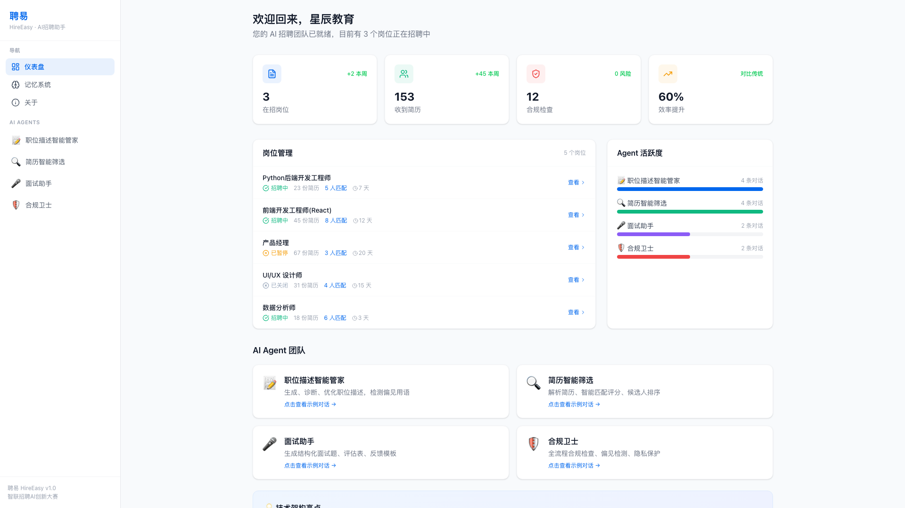
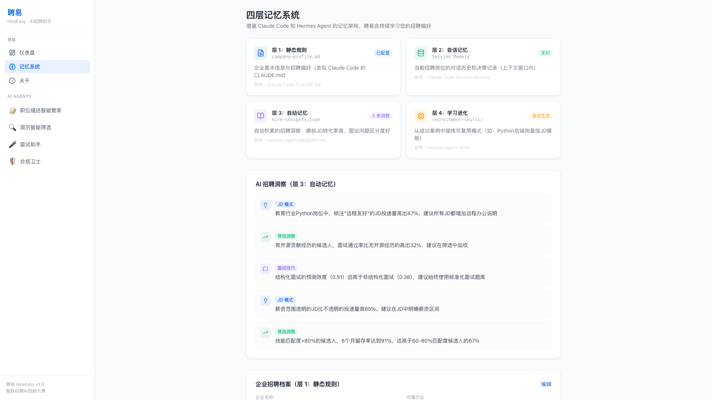

# 聘易 HireEasy — 中小企业 AI 招聘全流程助手

<div align="center">

**🏆 智联招聘首届全国AI创新大赛 · AI+招聘赛道**

[](https://bcefghj.github.io/hire-easy/)
[](https://github.com/bcefghj/hire-easy/raw/main/docs/聘易HireEasy_技术说明书.pdf)
[](https://github.com/bcefghj/hire-easy/raw/main/docs/聘易HireEasy_演示PPT.pdf)
[](https://github.com/bcefghj/hire-easy/raw/main/docs/聘易HireEasy_产品创意方案.pdf)
[](https://github.com/bcefghj/hire-easy/releases/latest)

> **让每家小企业，都有自己的 AI 招聘官。**

</div>

---

## 🎯 背景与问题

中国有 **90%** 的企业是中小微企业，贡献了 **80%** 的城镇就业。但其中：

- **78%** 的年度招聘预算不足 5 万元
- 大多数没有专职 HR
- 每个岗位平均收到 **127 份**简历，人工筛选耗费 4-6 小时
- 传统招聘周期平均 **45 天**，费用约 **2 万元**

> 数量最多，困难最大。这就是聘易要解决的问题。

---

## 🖥️ 产品截图

### 仪表盘 — 招聘全局一览


### JD Agent — 职位描述智能生成 + 六维健康度诊断




### Screen Agent — 简历多维匹配评分


### Compliance Agent — 合规检测 + 偏见识别


### 四层记忆系统



---

## 📦 参赛材料

| 材料 | 说明 | 下载 |
|------|------|------|
| 技术说明书 | 105 页完整技术文档，含架构设计、合规分析、测试报告、案例研究 | [📄 PDF](https://github.com/bcefghj/hire-easy/raw/main/docs/聘易HireEasy_技术说明书.pdf) |
| 演示 PPT | 22 页现代主题 Beamer 演示，含真实产品截图，深色 Navy 风格 | [📊 PDF](https://github.com/bcefghj/hire-easy/raw/main/docs/聘易HireEasy_演示PPT.pdf) |
| 产品创意方案 | 4 页精美产品介绍 PDF，含截图展示、技术亮点、市场数据 | [🎨 PDF](https://github.com/bcefghj/hire-easy/raw/main/docs/聘易HireEasy_产品创意方案.pdf) |
| 演示视频 | 5 分钟产品演示 MP4（1080p，含 TTS 语音讲解和字幕） | [🎬 Releases](https://github.com/bcefghj/hire-easy/releases/latest) |
| 在线 Demo | 可交互的真实产品，无需安装 | [🌐 体验](https://bcefghj.github.io/hire-easy/) |

---

## 🤖 四大 AI Agent

聘易以四个专业化 AI Agent 组成**虚拟招聘团队**，让企业主像跟 HR 对话一样完成全流程招聘：

| Agent | 名称 | 核心功能 |
|-------|------|----------|
| 📝 **JD Agent** | 职位描述智能管家 | JD 智能生成、**六维健康度诊断**（完整性/清晰度/吸引力/合规性/SEO/偏见风险）、偏见扫描、一键优化 |
| 🔍 **Screen Agent** | 简历智能筛选 | 简历解析、**多维度匹配评分**（技能/经验/教育/软实力）、候选人排序、批量处理 |
| 🎤 **Interview Agent** | 面试助手 | 结构化面试题生成、评估量表、反馈模板 |
| 🛡️ **Compliance Agent** | 合规卫士 | JD 偏见检测（年龄/性别/地域）、数据安全评估、**80% 规则**公平性监控 |

---

## 🧠 技术架构

### Agent = Model + Harness

借鉴 2026 年 Agent 工程核心共识：模型提供智能，Harness 保证可靠性。

```
用户界面层
    ↓
QueryEngine 编排引擎（会话生命周期管理、ReAct 循环）
    ↓
Tools 工具系统（每个工具独立 schema / 权限 / 并发控制）
    ↓
Context / Memory / State（四层记忆 + 三级压缩）
    ↓
Agent Collaboration（coordinatorMode 纯 prompt 编排多 Agent）
    ↓
Security Governance（权限门控 + 审计日志）
```

### Claude Code 架构映射

深度学习 [Claude Code](https://code.claude.com/) 46K 行 TypeScript 源码架构：

| Claude Code 模式 | 聘易 HireEasy 对应 |
|---|---|
| QueryEngine（AsyncGenerator 接口） | 招聘会话引擎：管理 JD 发布 → 简历筛选 → 面试 → Offer 全流程状态 |
| Tool Protocol（独立 schema + 权限） | 招聘工具集：JD 生成 / 简历解析 / 匹配打分 / 合规检测 |
| StreamingToolExecutor（读写分离并发） | 并行处理多候选人简历筛选，JD 修改串行保证一致性 |
| coordinatorMode.ts（纯 prompt 编排） | 招聘协调器：用 prompt 无缝编排各子 Agent |
| bashSecurity.ts（23 项安全检查） | 候选人数据操作权限检查，防止越权访问 |

### 四层记忆系统

借鉴 [Hermes Agent](https://nousresearch.com/hermes/) 的记忆架构设计：

| 层级 | 文件 | 功能 | 参考来源 |
|------|------|------|----------|
| 层 1：静态规则 | `company-profile.md` | 企业信息、行业、招聘偏好永久保存 | Claude Code CLAUDE.md |
| 层 2：会话记忆 | Session Memory | 当前岗位对话历史和决策记录 | Claude Code Session Memory |
| 层 3：自动记忆 | `hire-insights.json` | 自动积累的招聘洞察（越用越懂你） | Hermes Agent MEMORY.md |
| 层 4：学习进化 | `recruitment-skills/` | 从成功案例中提炼的可复用招聘模式 | Hermes Agent Skills 系统 |

---

## ⚖️ 合规引擎

内置中国及国际合规法规，招聘 AI 必须合规先行：

| 法规 | 关键条款 | 聘易实现 |
|------|----------|----------|
| 《个人信息保护法》 | 第 28 条：敏感信息单独同意 | 数据最小化 + 加密存储 |
| 《就业促进法》 | 第 27-31 条：禁止就业歧视 | JD 偏见检测 + 自动修改建议 |
| EU AI Act（2026.8.2 生效） | 招聘 AI 为高风险系统 | 人类监督 + 透明度报告 |
| EEOC 80% 规则 | 少数群体通过率 ≥ 多数群体 80% | 实时仪表盘监控 |

---

## 🛠️ 技术栈

| 层 | 技术 | 说明 |
|---|---|---|
| 前端框架 | React 19 + Vite 8 + TypeScript 6 | 类型安全，极速构建 |
| UI 设计 | Tailwind CSS 4 + Radix UI + Lucide Icons | 现代化设计系统 |
| AI 引擎 | MiniMax M2.7 API | 100 TPS 极速推理 |
| 状态管理 | Zustand + localStorage | 轻量级，支持四层记忆持久化 |
| Markdown | react-markdown + remark-gfm | AI 回复富文本渲染 |
| 部署 | GitHub Pages | 免费稳定，全球访问 |

---

## 🚀 快速开始

### 环境要求

- Node.js >= 18
- npm >= 9

### 安装运行

```bash
# 克隆项目
git clone https://github.com/bcefghj/hire-easy.git
cd hire-easy

# 安装依赖
npm install

# 启动开发服务器
npm run dev
```

访问 `http://localhost:5173` 即可体验（内置完整示例数据，无需配置 API Key）。

### 配置 AI API（可选）

创建 `.env` 文件后可接入真实 AI 推理：

```env
VITE_MINIMAX_API_KEY=your_minimax_api_key_here
```

### 部署到 GitHub Pages

```bash
npm run deploy
```

---

## 📁 项目结构

```
hire-easy/
├── docs/                           # 参赛文档材料
│   ├── 聘易HireEasy_技术说明书.pdf  # 105 页技术说明书
│   ├── 聘易HireEasy_演示PPT.pdf    # Beamer 演示幻灯片
│   └── screenshots/                # 产品截图
├── src/
│   ├── App.tsx                     # 主入口
│   ├── components/
│   │   └── Sidebar.tsx             # 侧边导航
│   ├── pages/
│   │   ├── Dashboard.tsx           # 仪表盘（岗位管理 + Agent 活跃度）
│   │   ├── ChatView.tsx            # Agent 对话界面（支持 Markdown 渲染）
│   │   ├── MemoryView.tsx          # 四层记忆系统可视化
│   │   └── AboutView.tsx           # 关于页
│   ├── stores/
│   │   └── appStore.ts             # Zustand 全局状态（含记忆持久化）
│   ├── lib/
│   │   └── api.ts                  # MiniMax API 集成 + Fallback 示例数据
│   └── data/
│       ├── agents.ts               # 四个 Agent 配置定义
│       └── demoData.ts             # 完整示例数据（JD/简历/合规/记忆）
├── vite.config.ts                  # Vite 配置（含 GitHub Pages base path）
└── package.json
```

---

## 📊 市场数据

| 指标 | 数据 | 来源 |
|------|------|------|
| 中小微企业占比 | **90%** | 中国经济网 |
| 在线招聘市场规模（2026） | **2507 亿元** | 行研图表 |
| 中小企业招聘预算 < 5 万 | **78%** | i人事 |
| 每岗平均无效简历 | **127 份** | i人事系统报告 |
| 传统招聘平均周期 | **45 天** | i人事系统报告 |
| 小微企业在线招聘渗透率 | **38.5%** | 行研图表 |

### 使用聘易后效果

| 指标 | 变化 |
|------|------|
| 招聘周期 | **-60%**（45 天 → 19 天） |
| 招聘成本 | **-45%**（2 万 → 5400 元） |
| 人岗匹配率 | **+42%** |

---

## 💰 商业模式

| 套餐 | 价格 | 功能 |
|------|------|------|
| 基础版 | 免费 | JD 生成/诊断（5 次/月），偏见检测 |
| 专业版 | ¥99/月 | 无限 JD + 简历筛选 + 面试题 |
| 企业版 | ¥299/月 | 全部功能 + 记忆系统 + 合规报告 + 优先支持 |

---

## 📚 参考资料

### 技术架构

- [Claude Code 源码分析](https://dev.to/lien_jp_db54b8b7fd9fa0118/claude-code-source-analysis-series-chapter-1-architecture-48d7) — DEV Community
- [Hermes Agent 记忆系统](https://vectorize.io/articles/hermes-agent-memory-explained) — vectorize.io
- [Agent Harness 设计模式](https://zylos.ai/research/2026-03-31-agent-harness-design-patterns) — Zylos Research
- [Production AI Agent Architecture](https://artinoid.com/blog/production-ai-agent-architecture-claude-code-lessons) — Artinoid
- [We Removed 80% of Our Agent's Tools](https://vercel.com/blog/we-removed-80-percent-of-our-agents-tools) — Vercel Engineering

### 合规法规

- 《中华人民共和国个人信息保护法》（2021）
- 《中华人民共和国就业促进法》（2015 修订）
- [EU AI Act](https://www.amcham.ro/business-intelligence/the-use-of-ai-systems-in-recruitment)（2026.8.2 生效）
- EEOC Uniform Guidelines（80% Rule）

### 市场数据

- [中国经济网 — 中小微企业就业数据](http://www.ce.cn/xwzx/gnsz/gdxw/202503/24/t20250324_39329282.shtml)
- [i人事 — 中小企业招聘效率报告](https://docs.ihr360.com/hr/374465)
- [凤凰网 — 主流招聘平台测评](https://biz.ifeng.com/c/8qAe3QdNgcg)

---

## 🏅 参赛信息

| 项目 | 详情 |
|------|------|
| 大赛 | 智联招聘首届全国AI创新大赛 |
| 赛道 | AI + 招聘 |
| 参赛者 | 戴尚好 |
| 院校 | 中国科学技术大学 |
| 联系方式 | bcefghj@163.com |

---

## License

MIT

---

<div align="center">
  <strong>聘易 HireEasy</strong> · 让每家小企业都有自己的 AI 招聘官<br>
  <a href="https://bcefghj.github.io/hire-easy/">🌐 立即体验</a> ·
  <a href="https://github.com/bcefghj/hire-easy/raw/main/docs/聘易HireEasy_技术说明书.pdf">📄 技术说明书</a> ·
  <a href="https://github.com/bcefghj/hire-easy/releases/latest">🎬 演示视频</a>
</div>
